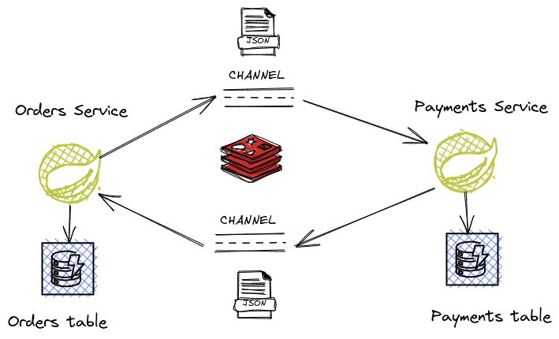

# SAGA Pattern Using Redis PubSub

This project is an example of Saga Patter using Redis PubSub



## Technologies:

- JDK 11
- Gradle
- SpringBoot
- Redis
- DynamoDB
- Podman
- TestContainers

## How to Run

1. Download [AWS Cli](https://docs.aws.amazon.com/cli/latest/userguide/getting-started-version.html)

2. Configure AWS Cli:
```shell script
$ aws configure
```

3. Run Services:
```shell script
podman-compose up -d
```

4. The startup should run the script **dynamodb.sh**, but it's not working because a problem permission about /var/run/docker.sock, so it's necessary to run the script manually

```shell script
sh dynamodb.sh
```

5. Run application using the prod profile

```shell script
$ ./gradlew bootRun --args='--spring.profiles.active=dev'
```

### Creating a New Order

To create a new order run the following command:

```shell script
curl --request POST \
  --url http://localhost:8082/orders/v1 \
  --header 'Content-Type: application/json' \
  --data '{
	"total_amount": 50.00,
	"total_discount": 10.00,
	"items": [
		{
			"product_id": "66411c09-95ff-436f-b23c-68b3489dc9a8",
			"quantity" : 1,
			"amount": 50.00
		}
	]
}'

```

### Searching an existing order

```shell script
curl --request GET \
  --url http://localhost:8082/orders/v1/da2b550f-aaad-4efe-88a7-44dfac5a1e06
```


